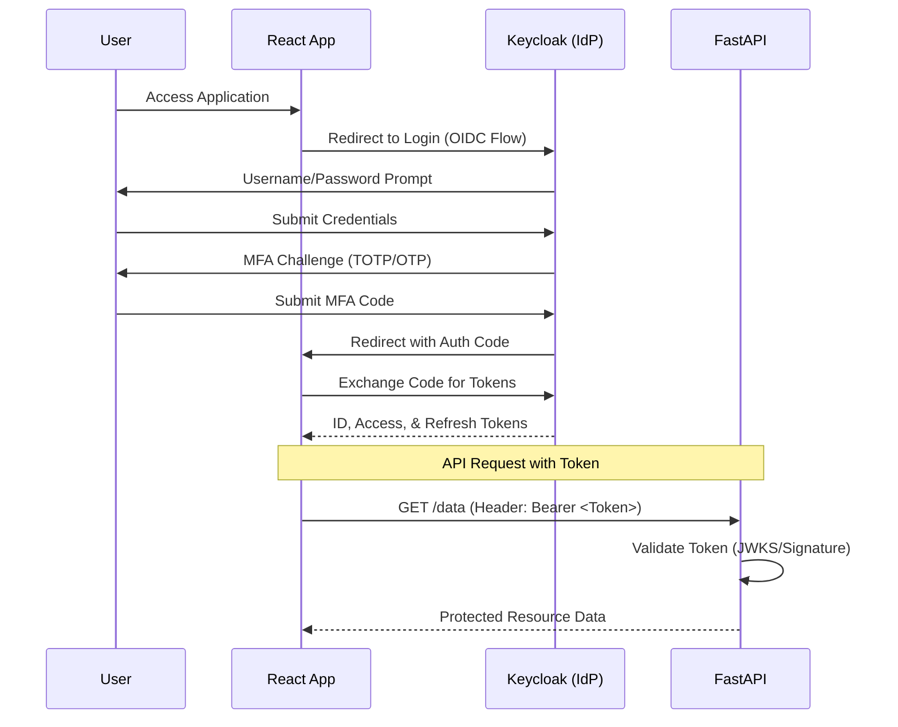

# SSO/OAuth2 with MFA Implementation Guide

This document outlines the architecture, workflow, and code implementation for a secure Single Sign-On (SSO) system using OAuth2/OpenID Connect (OIDC) with Multi-Factor Authentication (MFA).

## 1. High-Level Architecture

The architecture uses **Keycloak** as the Identity Provider (IdP), **FastAPI** as the Resource Server (Backend), and **React** as the Client (Frontend).



---

## 2. Keycloak Configuration (MFA)

To enable MFA in Keycloak:
1. **Authentication Flow**: Go to "Authentication" -> "Flows". Copy the "Browser" flow.
2. **Add Execution**: Add "OTP Form" (Required) after the "Username Password Form".
3. **Bind Flow**: Bind the new flow as the default "Browser Flow" for your realm.
4. **Required Action**: Set "Configure OTP" as a default required action for new users.

---

## 3. Frontend Implementation (React)

### `keycloak.ts` (Initialization)
```typescript
import Keycloak from "keycloak-js";

const keycloak = new Keycloak({
  url: "https://auth.example.com/",
  realm: "my-realm",
  clientId: "my-frontend-client",
});

export const initKeycloak = (onAuthenticatedCallback: Function) => {
  keycloak
    .init({ 
      onLoad: "check-sso", 
      silentCheckSsoRedirectUri: window.location.origin + "/silent-check-sso.html",
      pkceMethod: "S256" 
    })
    .then((authenticated) => {
      if (authenticated) {
        onAuthenticatedCallback();
      } else {
        keycloak.login();
      }
    });
};

export default keycloak;
```

### `api.ts` (Axios Interceptor)
```typescript
import axios from "axios";
import keycloak from "./keycloak";

const api = axios.create({
  baseURL: "http://localhost:8000",
});

api.interceptors.request.use(async (config) => {
  if (keycloak.token) {
    // Refresh token if it's expired or about to expire (30s buffer)
    await keycloak.updateToken(30);
    config.headers.Authorization = `Bearer ${keycloak.token}`;
  }
  return config;
});

export default api;
```

---

## 4. Backend Implementation (FastAPI)

### `auth.py` (Dependency)
```python
import jwt
from fastapi import Depends, HTTPException, status
from fastapi.security import OAuth2PasswordBearer
from typing import Optional

# Configuration
KEYCLOAK_URL = "https://auth.example.com/realms/my-realm"
JWKS_URL = f"{KEYCLOAK_URL}/protocol/openid-connect/certs"
AUDIENCE = "account"

oauth2_scheme = OAuth2PasswordBearer(tokenUrl="token")

async def get_current_user(token: str = Depends(oauth2_scheme)):
    try:
        # 1. Fetch JWKS from Keycloak (should be cached in production)
        # 2. Decode and validate token
        payload = jwt.decode(
            token, 
            key=get_public_key(token), # Helper to get key from JWKS
            algorithms=["RS256"], 
            audience=AUDIENCE,
            issuer=KEYCLOAK_URL
        )
        
        # 3. Optional: Verify MFA was used (check 'acr' claim)
        # 'acr': '1' usually means password, '2' or higher often means MFA
        if payload.get("acr") != "gold": # Example custom ACR for MFA
             pass # Logic to enforce MFA if needed
             
        return payload
    except Exception as e:
        raise HTTPException(
            status_code=status.HTTP_401_UNAUTHORIZED,
            detail="Invalid authentication credentials",
            headers={"WWW-Authenticate": "Bearer"},
        )
```

---

## 5. Security Best Practices

1. **Use PKCE**: Always use Proof Key for Code Exchange (PKCE) for public clients (Frontend).
2. **Token Validation**: Backend must validate the signature, expiration (`exp`), issuer (`iss`), and audience (`aud`).
3. **MFA Enforcement**: Configure Keycloak to require MFA for specific roles or high-risk actions.
4. **HTTPS**: Never transmit tokens over unencrypted channels.
